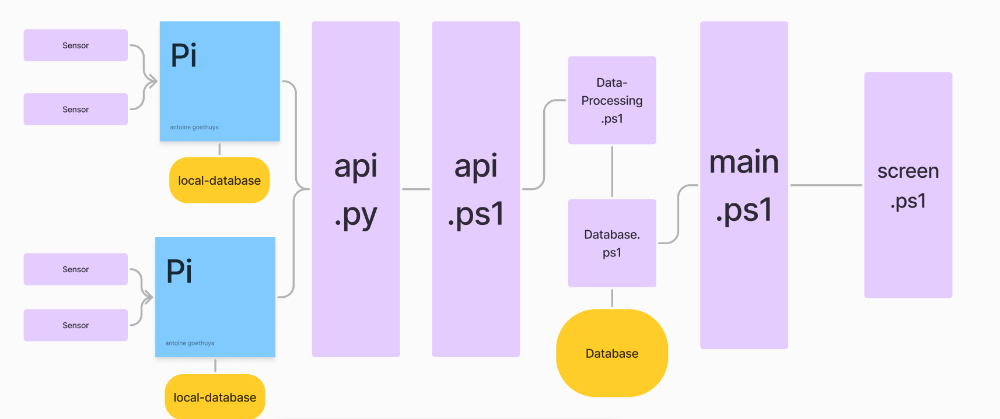
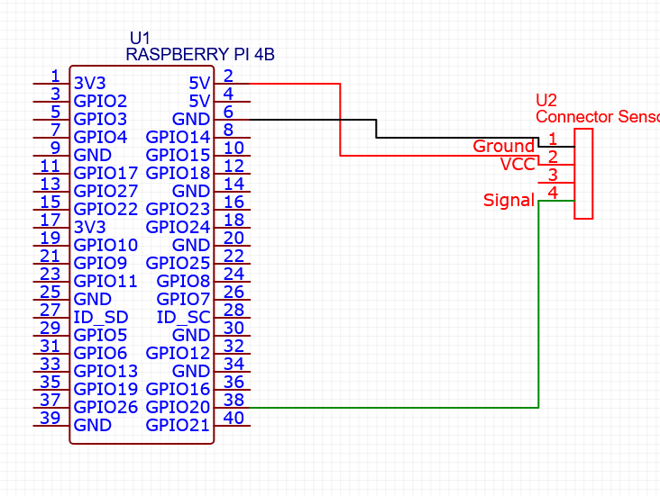

# Pi-Sensor-Monitoring-Powershell
A system that helps manage and monitor sensors that are connected to Pi's via powershell

---

# Project Composition 


## client/server
all what is powershell

## Sensors/api
all what is python +
all the electronic parts:
- Rasberry Pi 4B 4GB
- Grove - Light Sensor
- Breadboard


---
# Setup
## for setup the client part
### Prerequisites
#### PowerShell: 
  Ensure you have PowerShell installed. You can download it from Microsoft's official site.
### Installation
1. Clone the repository:
```
git clone https://github.com/antoineGoethuys/Pi-Sensor-Monitoring-Powershell.git
cd Pi-Sensor-Monitoring-Powershell
```
2. Navigate to the project directory:
```
cd Pi-Sensor-Monitoring-Powershell
```
### Running the PowerShell Scripts
1. Run the main PowerShell script:
```
pwsh main.ps1
```
## for setup the pi parts
### Prerequisites
#### Python: 
  Ensure you have Python installed. You can download it from python.org.
#### Pip: 
  Ensure you have pip installed. It usually comes with Python.
#### Electrical
  Ensure that the sensor is correcly connected to the pi. (See electrical schema)

### Installation
Connect you to your pi
1. Clone the repository:
```
git clone https://github.com/antoineGoethuys/Pi-Sensor-Monitoring-Powershell.git
```

2. Navigate to the **Sensor** directory:
```
cd Pi-Sensor-Monitoring-Powershell/Sensor
```

3. Install the required Python packages:
```
pip install -r requirements.txt
```
### Running
```
python api.py
```
This will start the FastAPI server on http://0.0.0.0:8000. You can access the endpoints defined in the script.

---

## Endpoints api of sensor

Get GPIO status:
```
GET /gpio
```
Get specific GPIO pin status:
```
GET /gpio/{pin}
```
Get GPIO pin log:
```
GET /gpio/{pin}/log
```

---

# Project To-Do List

## Core Tasks
- [x] Store sensor data in SQLite database
- [x] Develop a real-time monitoring dashboard
- [x] Set up notifications for abnormal sensor values
- [ ] Create configuration pages:
  - [ ] Raspberry Pi settings (network config, naming)
    - [x] Ip adress
  - [ ] Sensor settings (data type, value deviations)

## Sensor Integration
- [x] Integrate and test Light-Sensor functionality

## Extended Features
- [ ] Add support for new sensors:
  - [ ] Tilting sensor
  - [ ] 3-axis digital accelerometer
  - [ ] Line finder
  - [ ] DHT11
- [ ] Enable file-based configuration for sensors/Pi
- [ ] Implement historical data analysis and reporting
- [ ] Set up cloud storage integration for data backup
- [ ] Group Raspberry Pi and sensors into clusters
- [ ] Connect to IoT platforms:
  - [ ] Home Assistant
  - [ ] AWS IoT
  - [ ] Azure IoT
  - [ ] Google Cloud IoT
- [ ] Develop a map feature for Pi locations
- [ ] Add external module interaction (e.g., motors, actuators)
- [ ] Monitor Raspberry Pi hardware metrics (CPU, battery, RAM)
- [ ] Implement data pattern recognition
- [ ] Create an integrated tutorial

## Support Tasks
- [ ] Set up Docker environment
- [x] Configure Git for version control
- [x] Configure SQLite database
- [ ] Acquire and test sensor modules

## Documentation
- [x] Write installation and configuration guide
- [ ] Create sensor-specific documentation
- [ ] Develop interface tutorial (optional)

## Testing and Structure
- [ ] Implement Pester unit tests with mockups
- [x] Apply microservices architecture for code structure

## Risk Management
- [ ] Plan for hardware/software compatibility issues
- [ ] Address security risks for networked sensors


---

# sources: 
- co-pilot
- official documentation of Microsoft Powershell
- official documentation of python (sqlite / threading / signal / sys / time)
- documentation of RPi.GPIO / uvicorn / fastapi
- [tutorial SQLite Powershell](https://www.youtube.com/watch?v=oIodLO-L24Q)